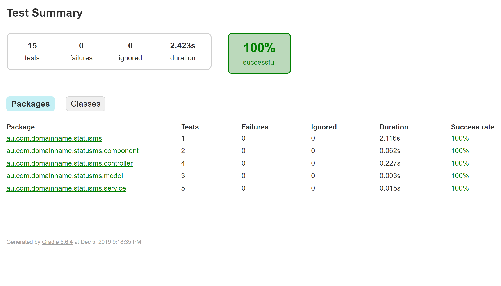
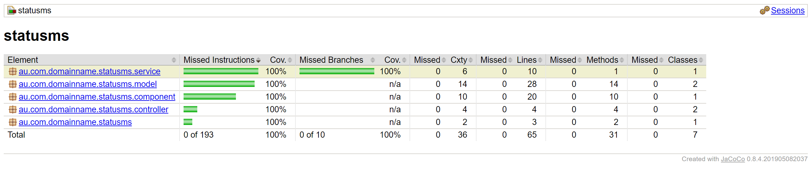

Status Information Microservice (SIMs)
===============================

Introduction
------------
The purpose of this project is to provide a basic Spring-boot Microservice  that enables developers the ability to Test, Build and Publish their work.
As a result, 2 endpoints will be made available:

- A root `/` endpoint with a basic "Hello World" message.
- A `/status` endpoint that returns the version of the application along with the last commit.

Intended audience / Aim
----------------------
*A fellow developer who is looking for a quick-start reference to create a  new micro-service.*

Technologies
-------------
A developer is free to choose language and/or framework based on their preferences, however, this project has been build using following technologies.

- Programming Language: **Java 8**
- Framework: **Spring-Boot(2.2.1)**
- Build Tool: **Gradle(5.6.4)**
- IDE: **Spring Tool Suite 3**
- Testing Framework: **JUnit, Mockito**
- Documentation: **Swagger2.0**
- Containerization: **Docker**
- CI/CD: **TravisCI**
- Libraries/plugin:
	- **Apache Commons**	
	- **Springfox-Swagger**
	- **JACOCO**

Project scope
-------------
- In-Scope
	- Implement a Microservice with only **GET** calls
	- Demonstrate code practices
		- **SOLID** and **DRY** principle
		- Fail fast approach
		- 3rd party libraries
	- Basic Unit Testing
	- Code coverage.
- Out-Of-Scope
	- Logging framework.
	- Exception handling framework.
	- Data persistence.

Technical Documentation
-----------------------

	http://localhost:8080/swagger-ui.html#/

Local execution steps
----------------------

- Project Checkout

		$ git clone git@github.com:scorpio-13/status-ms.git 
 
- Build and test

		$ gradlew clean build

- Package the jar

		$ gradlew jar

- Run the Executable Jar

		$ java -jar java -jar build\libs\statusms-1.0.jar

- Additional Steps(optional)  
	- Execute tests 
		
			$ gradlew test
		
	
	- Generate Code Coverage Report
			
			$ gradlew jacocoTestReport
		 Reports location - .
	- Exit the CLI
			
			$ exit

Coverage Report
--------------
- **Unit Test Report** - `build/reports/tests/test/index.html`
	

- **Code Coverage Report** - `build/reports/jacoco/index.html`
 

Limitations and Risks
---------------------

1. APIs should be on https
2. APIs should have authentication and authorization integrated like **okta**
3. CI needs to perform static analysis and composition analysis
4. APIs need to be tested for performance
5. Security hardening of API by pen-testing the application for common vulnerabilities.
6. Database layer integration needs to be considered.
7. Swagger schema should be defined.
8. Contract testing framework like **packt** etc should be implemented
9. Proper versioning semantics needs to be implemented
10. Artefact storage and gradle caching needs to be implemented

Future Enhancements
------------------
- **Lombok**
- Circuit Breaker Pattern
- Observability Matrix
	- Acuator, New Relic, SUMO
- BDD framework - **Spock**
- Code Analysis Solution - **checkmarx, Synk**