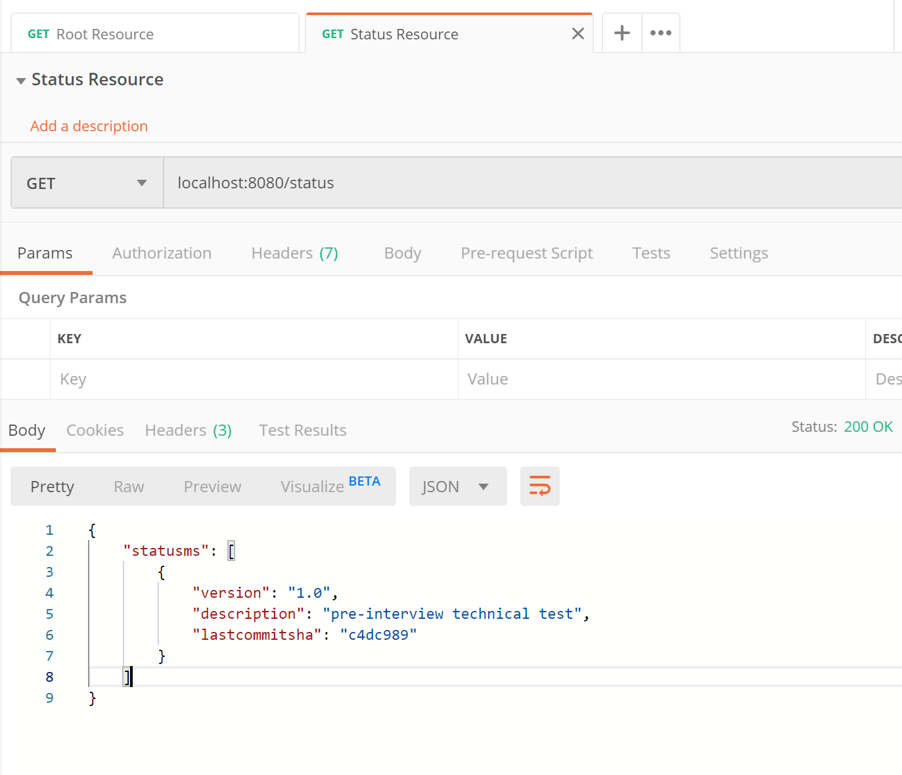

Status Information Microservice (SIMs) 
===============================

Introduction
------------
The purpose of this project is to provide a basic Spring-boot Microservice  that enables developers the ability to test, build and publish their work.
As a result, 2 endpoints will be made available:

- A root `/` endpoint with a basic "Hello World" message.
- A `/status` endpoint that returns the version of the application along with the last commit.

Intended audience / Aim
----------------------
*A fellow developer who is looking for a quick-start reference to create a  new micro-service.*

Technologies
-------------
A developer is free to choose language and/or framework based on their preferences, however, this project has been build using following technologies.

- Programming Language: **Java 8**
- Framework: **Spring-Boot(2.2.1)**
- Build Tool: **Gradle(5.6.4)**
- IDE: **Spring Tool Suite 3**
- Testing Framework: **JUnit, Mockito**
- Documentation: **Swagger2.0**
- Containerization: **Docker**
- CI/CD: **TravisCI**
- Libraries/plugin:
	- **Apache Commons**	
	- **Springfox-Swagger**
	- **JACOCO**

Project scope
-------------
- In-Scope
	- Implement a Microservice with only **GET** calls
	- Demonstrate code practices
		- **SOLID** and **DRY** principle
		- Fail fast approach
		- 3rd party libraries
	- Basic Unit Testing
	- Code coverage.
- Out-Of-Scope
	- Logging framework.
	- Exception handling framework.
	- Data persistence.

Technical Documentation
-----------------------

	http://localhost:8080/swagger-ui.html#/

Local execution steps 
----------------------

- Project Checkout

		$ git clone git@github.com:scorpio-13/status-ms.git 
		$ cd status-ms

- Option 1: With Docker
	- Build and test Docker image.
      			
			$ docker build . -t status-ms:latest
    - Verify Docker image built successfully
      		
			$ docker image ls status-ms:latest
    - Run Docker image  

			$ docker run -p8080:8080 status-ms:latest

- Option 2: Without Docker
 
	- Build and test
			
			$ ./gradlew clean build
	
	- Package the jar
	
			$ ./gradlew jar
	
	- Run the Executable Jar
	
			$ java -jar build/libs/statusms-1.0.jar
	
	- Additional Steps(optional)  
		- Execute tests 
			
				$ ./gradlew test
			
		
		- Generate Code Coverage Report
				
				$ ./gradlew jacocoTestReport

Executing Existing Docker Image
-------------------------------
	
	$ docker run -p8080:8080 scorpio13/status-ms:latest

Testing REST endpoints
----------------------

- A Postman Collection with 2 endpoints is available in the source code(the collection is created for `localhost:8080`)
	
- From terminal `curl -X GET "http://localhost:8080/status" -H "accept: */*"`
- From SwaggerUI - please refer to the `Technical Documentation` section.

Coverage Report
--------------
- **Unit Test Report** - `build/reports/tests/test/index.html`

- **Code Coverage Report** - `build/reports/jacoco/index.html`
 

Limitations and Risks
---------------------

1. **HTTPS** should be enabled to provide secure communication.
2. APIs must integrate authentication and authorization providers like **okta, OPA**
3. Security hardening of API should be considered, by **pen-testing** the application for common vulnerabilities.
4. API/CODE/Docker image version strategies needs to be considered.
5. CI needs to perform static analysis and composition analysis
6. Bench-marking API performance.
7. Contract testing framework like **packt** etc should be implemented
8. Database layer integration needs to be considered.
9. Swagger schema should be defined.
10. Artefact storage and gradle caching needs to be implemented
11. Deployment tooling and strategy should be considered.

Future Enhancements
------------------
- Circuit Breaker Pattern - **Hystrix**
- Build Observability - **Actuator, New Relic, SUMO**
- BDD framework - **Spock**
- Code Analysis Solution - **checkmarx, Snyk**
- Code Quality - **SonarQube,Lombok**
- Database Layer and search indexer
